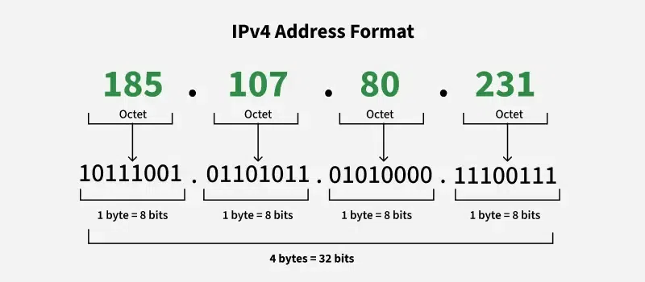
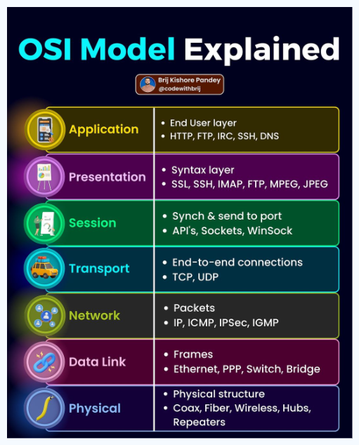
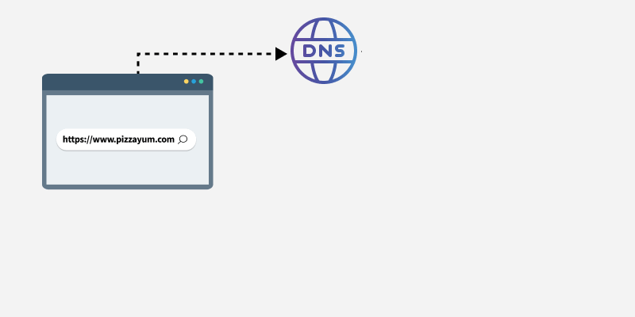

## 1. IP Address?

An IP Address is a unique number assigned to every device in a network so it can be identified and communicate.

- Example: `192.168.1.10` (IPv4)
- Types:
  - Private IP — used inside local networks
  - Public IP — used on the internet
- Versions:
  - IPv4 → 32-bit (like 192.168.1.1)
  - IPv6 → 128-bit (like fe80::1)



#### 🌐 Localhost (Loopback)

Used to refer to **your own computer**

- `127.0.0.1` → Localhost (correct)
- Range: `127.0.0.0 – 127.255.255.255`
- Used for:
  - testing
  - development
  - no internet needed

---

#### 🏠 Private IP Addresses

Used inside homes, offices, LAN networks  
Not accessible directly from internet.

##### 1. Class A Private Range

Used in big networks

```
10.0.0.0 – 10.255.255.255
```

Common examples:

- `10.0.0.1`
- `10.10.10.10`
- `10.1.1.1`

---

#### 2. Class B Private Range

Used in medium networks

```
172.16.0.0 – 172.31.255.255
```

Examples:

- `172.16.0.1`
- `172.20.5.10`
- `172.31.100.50`

❗ Only **172.16 → 172.31** are private  
Other 172.x are public

---

#### 3. Class C Private Range

Most common in home WiFi

```
192.168.0.0 – 192.168.255.255
```

Examples:

- `192.168.0.1`
- `192.168.1.1`
- `192.168.43.1` (Hotspot)

## 

#### 🌍 Public IP

Used on the **internet**  
Assigned by ISP

Examples:

- `8.8.8.8` (Google DNS)
- `142.250.183.14`
- `52.95.245.123`

Anyone on internet can reach (unless blocked).

---

#### Special IP Range

##### APIPA (Automatic Private IP)

Assigned when no DHCP / WiFi problem

```
169.254.x.x
```

Meaning:

- network problem
- failed to get IP

---

## 2. MAC Address?

A MAC Address is a **hardware identifier** burned into the network card by the manufacturer.

- Example: `A4:B3:22:1F:9C:10`
- Works at **Data Link Layer**
- Never changes (normally)

Think: **MAC = Physical identity**, **IP = Logical identity**

           - 48 bit address

---

#### 3. SSL/TLS?SSL

SSL (Secure Sockets Layer) its successor TLS (Transport Layer Security) are the technology behind the Lock Icon in your browser.It creates an encrypted tunnel between the client and server.Handshake: Before sending data, the client and server agree on a secret code (keys) so that even if someone intercepts the data, it looks like gibberish.

#### Public Key vs Private Key

| Feature        | Public Key                             | Private Key                          |
| :------------- | :------------------------------------- | :----------------------------------- |
| Who Owns It?   | Shared with everyone                   | Kept secret by the owner             |
| Security Level | Safe to share                          | Must never be shared                 |
| Used For       | Encrypting data, verifying signatures  | Decrypting data, creating signatures |
| Where It Lives | Servers, certificates, clients         | Secure storage / device              |
| Example Use    | Website SSL certificates, sharing keys | Logging into SSH, signing JWT        |
| Direction      | Lock / Encrypt                         | Unlock / Decrypt                     |
| If Leaked?     | Usually okay                           | Severe security risk                 |

---

##### Simple Understanding

- **Public Key = Lock**
  Anyone can lock (encrypt) data for you.

- **Private Key = Key**
  Only you can unlock (decrypt) and access it.

---

##### Encryption

- Sender: Encrypts with **Public Key**
- Receiver: Decrypts with **Private Key**

##### Digital Signature

- Sender: Signs with **Private Key**
- Receiver: Verifies with **Public Key**

## 4.Default Ports (Most Important)

| Service             | Port  |
| ------------------- | ----- |
| HTTP                | 80    |
| HTTPS               | 443   |
| FTP                 | 21    |
| SSH                 | 22    |
| DNS                 | 53    |
| SMTP (Mail Sending) | 25    |
| POP3 (Receive Mail) | 110   |
| IMAP                | 143   |
| MySQL               | 3306  |
| MongoDB             | 27017 |

Port = Doorway for communication.

---

## 5.TCP / IP Model

**Layers:**

1. Application
2. Transport
3. Internet
4. Network Access

**Protocols:**

- HTTP, HTTPS, FTP
- TCP, UDP
- IP
- Ethernet


---

## 6. OSI Model (7 Layers)

1. Physical: Cables, fiber optics (The truck carrying the mail).
2. Data Link: MAC addresses, switches (The envelope).
3. Network: IP addresses, routing (The address on the envelope).
4. Transport: TCP/UDP (The guarantee of delivery).
5. Session: Establishing a connection.
6. Presentation: Encryption, data format (JPEG, MP4).
7. Application: What the user sees (HTTP, FTP).



---

## 7.Client-Server Architecture

**Client:** Requests data  
**Server:** Responds with data

Examples:

- Browser → Client
- Website → Server


---

## 8. HTTP?

HTTP = Hyper Text Transfer Protocol  
Used to transfer web pages.

- Stateless (no memory between requests)
- Uses port 80
- Text-based communication

HTTPS = Secure HTTP (encrypted)  
Uses port 443.

---

## 9. HTTP Methods

| Method  | Use                     |
| ------- | ----------------------- |
| GET     | Read data               |
| POST    | Send/Create data        |
| PUT     | Update data             |
| DELETE  | Delete data             |
| PATCH   | Partial update          |
| HEAD    | Header only             |
| OPTIONS | Check available methods |

### 10. Cookies vs Sessions vs Local Storage

| Feature                       | Cookies                            | Sessions                      | Local Storage                      |
| ----------------------------- | ---------------------------------- | ----------------------------- | ---------------------------------- |
| Stored Where?                 | Browser                            | Server                        | Browser                            |
| Data Lifetime                 | Set by expiry                      | Until user logs out / expires | Until manually cleared             |
| Size Limit                    | ~4KB                               | Depends on server             | ~5–10MB                            |
| Security                      | Can be stolen if not secured       | More secure                   | Less secure                        |
| Accessible By                 | Client + Server                    | Server only                   | Client (JavaScript)                |
| Best For                      | Auth tokens, tracking, remember me | Login session, user identity  | Preferences, theme, small app data |
| Automatically Sent to Server? | Yes (with every request)           | No                            | No                                 |
| Works Offline?                | Yes                                | No                            | Yes                                |

---

## 11. HTTP Status Codes

### Success

200 OK — Successful  
201 Created — Resource created

### Redirect

301 Moved Permanently  
302 Found

### Client Errors

400 Bad Request  
401 Unauthorized  
403 Forbidden  
404 Not Found

### Server Errors

500 Internal Server Error  
503 Service Unavailable

## 

## 12. APIs?

API = Application Programming Interface  
Allows communication between applications.

Example:

- Mobile app talking to server
- Weather app fetching weather data

Types:

- REST
- GraphQL
- SOAP

## 

## 13. DNS

DNS = Domain Name System  
Converts domain names to IP addresses.

Example:
`google.com → 142.250.183.14`

Without DNS we would need to remember IPs.



---

## 14. URL Breakdown

Example:

```url
https://www.example.com:443/home/index.html?user=1
```

- Protocol → https
- Domain → example.com
- Subdomain → www
- Port → 443
- Path → /home/index.html
- Query → ?user=1

---

## 15. CNAME

CNAME = Canonical Name

Maps one domain name to another domain.

Example:

```url
blog.example.com → example.medium.com
```

Used in hosting, CDNs, custom domains.

---

## 16. Proxy?

A proxy acts as a **middleman** between user and internet.

Uses:

- Security
- Filtering
- Hiding identity
- Caching

---

## 17. VPN

VPN = Virtual Private Network

What it does:

- Encrypts internet traffic
- Hides IP
- Provides privacy
- Allows secure remote access

Useful for:

- Secure browsing on public WiFi
- Accessing blocked content
- Corporate secure connections

---

## 18. TCP vs UDP

| TCP                | UDP                      |
| ------------------ | ------------------------ |
| Reliable           | Not reliable             |
| Slower             | Faster                   |
| Connection based   | Connectionless           |
| Used in Web, Email | Used in Games, Streaming |

---

## 19. Bandwidth?

Speed of data transfer capacity of network.

---

## 20. Latency?

Delay time in data transfer.

Lower latency = faster response.

---

## 21. Packet

Data in network travels in small chunks called packets.

Contains:

- Source IP
- Destination IP
- Data

---

# 🔥 ADVANCED COMPUTER NETWORKS — QUICK NOTES

---

## 22. Subnetting?

Subnetting divides a large network into smaller networks.

Why?

- Better performance
- Improved security
- Efficient IP usage

Example:
Network: `192.168.1.0/24`
Subnetted into:

- 192.168.1.0/26
- 192.168.1.64/26
- 192.168.1.128/26
- 192.168.1.192/26

---

## 23. CIDR Notation

CIDR = Classless Inter-Domain Routing  
Represents network mask.

Example:

- `/24` → 255.255.255.0
- `/16` → 255.255.0.0
- `/32` → single IP

---

## 24. NAT?

NAT = Network Address Translation

Converts:
Private IP ↔ Public IP

Uses:

- Security
- Limited IPv4 saving
- Home routers

Types:

- Static NAT
- Dynamic NAT
- PAT (Port Address Translation)

![[../images/Pasted image 20260202225457.png]]
---

## 25. Firewall

Firewall controls incoming and outgoing traffic.

Can:

- Allow
- Block
- Filter

Types:

- Hardware firewall
- Software firewall
- Network firewall
- Application firewall (WAF)

---

## 26. Load Balancer

Distributes traffic across multiple servers.

Benefits:

- No server overload
- High availability
- Scalability

Types:

- L4 Load balancer
- L7 Load balancer

Examples:
NGINX, HAProxy, AWS ELB

---

## 27. CDN

CDN = Content Delivery Network

Stores website files in multiple locations worldwide.

Benefits:

- Faster loading
- Reduced server load
- Better user experience

Examples:
Cloudflare  
Akamai  
AWS CloudFront

---

## 28. WebSocket

Allows **real-time two-way communication**.

Used in:

- Chat apps
- Games
- Live tracking
- Stock trading

Unlike HTTP which is request-response only.

---

## 29 QoS (Quality of Service)

Controls and prioritizes network traffic.

Example:

- Give priority to video calls over downloads

Used in:

- Corporate networks
- VoIP
- Streaming

---

## 30. MPLS

Multi-Protocol Label Switching  
Fast packet forwarding using labels instead of IP routing.

Used in:

- ISP networks
- Enterprise WANs

### Simple q&a

---

#### Q1: Difference between HTTP and HTTPS?

HTTP → Data in plain text  
HTTPS → Data encrypted using SSL/TLS

---

#### Q2: TCP vs UDP?

TCP:

- Reliable
- Slow
- Connection-oriented
  Used in: Web, Emails

UDP:

- Fast
- Not reliable
- Connectionless
  Used in: Gaming, Streaming

---

#### Q3: What happens when you type google.com in browser?

1. DNS resolves domain to IP
2. Browser connects to server
3. HTTPS handshake
4. HTTP request sent
5. Server responds
6. Page loads

---

#### Q4: Difference between IP and MAC?

MAC → Physical identifier (hardware)  
IP → Logical identifier (network)

---

#### Q5: Latency vs Bandwidth?

Latency → Delay  
Bandwidth → Speed/Capacity

---

#### Q6: DNS Caching?

DNS stores resolved results so next time lookup is faster.

Exists at:

- Browser
- OS
- Router
- ISP

---

#### Q7: Difference between Router and Switch?

Router:

- Connects different networks
- Works at Network Layer

Switch:

- Connects devices in same network
- Works at Data Link Layer

---

#### Q8: DHCP?

Assigns IP addresses automatically.

---

#### Q9: ARP?

ARP = Address Resolution Protocol  
Maps IP → MAC

---

#### Q10. Packet Loss?

Packets lost during transfer due to:

- Congestion
- Hardware issues
- Weak network

---

#### Q11: Port Forwarding?

Expose internal service to internet via router.

---

#### Q12: VPN in simple words?

Creates secure encrypted tunnel between you and internet.

---

#### Q13: Proxy vs VPN?

Proxy → Hides identity only  
VPN → Hides identity + encrypts traffic

---

## Quick Revision Notes

### Networking Concepts

---

### 1. What is Routing?

Routing is the process of selecting the best path for data packets to travel from a source device to a destination device across a network.

#### Key Components

- Routers
- Routing Tables
- Routing Protocols

#### Types of Routing

- Static Routing – manually configured paths
- Dynamic Routing – automatic path selection

---

### 2. What Happens When You Ping a Website

#### Example: ping facebook.com

#### Steps:

1. **DNS Resolution**
   - Domain name is converted to IP address
   - Example: facebook.com → 57.144.56.1

2. **ICMP Packet Creation**
   - System creates an ICMP Echo Request packet

3. **Routing Table Lookup**
   - OS checks where to send packet next

4. **ARP Resolution**
   - Finds MAC address of the gateway

5. **Packet Sent to Router**

6. **Routers Forward Packet Across Internet**

7. **Facebook Server Responds**

8. **Reply Returns to Your Device**

---

### 3. IP Address Types

#### Local Private IP

Example:

- 10.36.173.15

#### Public IPv4

Example:

- 106.192.67.211

#### Public IPv6

Example:

- 2401:4900:caac:e542:5e7b:1927:7c77:5808

#### Commands

- Show IP addresses:
  ip addr

- Show neighbors (ARP table):
  ip neigh

- Show routing table:
  ip route

- Find public IP:
  curl ifconfig.me

---

### 4. Traceroute

Traceroute shows the path packets take across the internet.

Command:
traceroute facebook.com

#### What Traceroute Shows

- Each router hop
- Latency between hops
- Network path structure

#### Important Notes

- Some hops show \* \* \* due to ICMP blocking
- Final hops may be hidden for security

---

### 5. Routing Protocols Overview

Routing protocols decide HOW routers choose paths.

#### Two Main Categories

| Type                            | Example |
| :------------------------------ | :------ |
| Interior Gateway Protocol (IGP) | OSPF    |
| Exterior Gateway Protocol (EGP) | BGP     |

---

### 6. OSPF – Open Shortest Path First

- Used INSIDE one organization or ISP
- Calculates shortest path using Dijkstra algorithm
- Based on cost, bandwidth, and speed
- Fast and dynamic

#### Used In:

- Company networks
- University networks
- Internal ISP routing

#### Goal:

Find the best path inside a single network

---

### 7. BGP – Border Gateway Protocol

- Used BETWEEN different networks and ISPs
- Runs the entire internet
- Policy-based routing
- Does NOT care about speed or distance

#### What BGP Cares About:

- Business agreements
- Policies
- Stability
- AS-PATH

---

### 8. Difference Between OSPF and BGP

| Feature        | OSPF             | BGP              |
| :------------- | :--------------- | :--------------- |
| Type           | Interior (IGP)   | Exterior (EGP)   |
| Used In        | Inside a network | Between networks |
| Goal           | Shortest path    | Best policy path |
| Algorithm      | Dijkstra         | Path Vector      |
| Internet Usage | No               | Yes              |

---

#### Important Difference Again

| Protocol | Cares About                  |
| :------- | :--------------------------- |
| OSPF     | Speed / cost / shortest path |
| RIP      | Hop count (distance)         |
| BGP      | Policies and preferences     |

---

### 9. Autonomous System (AS)

#### Definition

An Autonomous System is a large network under single administrative control.

#### AS Number (ASN)

- Unique identifier for each network on the internet
- Example:
  - Google: AS15169
  - Facebook: AS32934

---

### 10. AS-PATH in BGP

- AS-PATH is a list of AS numbers a packet passes through
- Used for:
  - Loop prevention
  - Path selection

#### Example AS-PATH

AS100 → AS200 → AS32934

---

### 11. Important Commands Learned

#### DNS Lookup

nslookup facebook.com

#### Force IPv4 or IPv6

curl -4 ifconfig.me
curl -6 ifconfig.me

#### Trace Route

traceroute facebook.com

#### View ARP Table

ip neigh

---

### Final Summary

- OSPF is used inside networks
- BGP is used between networks
- Traceroute shows path, not protocol
- Internet routing is mostly BGP
- Your PC only knows next hop, not full path

---

### GATE Networking Revision – Application Layer Protocols

---

### 1. Electronic Mail System Overview

Email communication works using three main protocols:

| Protocol | Purpose                                 |
| :------- | :-------------------------------------- |
| SMTP     | Sending emails                          |
| POP3     | Receiving and downloading emails        |
| IMAP     | Receiving and managing emails on server |

---

### 2. SMTP – Simple Mail Transfer Protocol

#### Definition

SMTP is a protocol used to SEND emails from a client to a mail server and between mail servers.

#### Layer

- Application Layer Protocol
- Works over TCP

#### Default Port Numbers

- Port 25 – traditional SMTP
- Port 465 – SMTPS (SSL)
- Port 587 – SMTP with TLS (recommended)

---

#### Features of SMTP

- Used only for sending emails
- Text-based protocol
- Uses TCP for reliable delivery
- Works in push model (client pushes mail to server)

---

#### SMTP Communication Model

User → SMTP Client → SMTP Server → Destination SMTP Server → Receiver

---

#### SMTP Commands

Some important SMTP commands:

| Command   | Meaning                   |
| :-------- | :------------------------ |
| HELO      | Identify client to server |
| MAIL FROM | Sender address            |
| RCPT TO   | Receiver address          |
| DATA      | Start message body        |
| QUIT      | End session               |

---

#### Limitations of SMTP

- Cannot retrieve emails
- No authentication by default
- Works only for sending

---

### 3. POP3 – Post Office Protocol Version 3

#### Definition

POP3 is a protocol used to DOWNLOAD emails from mail server to client device.

#### Port Numbers

| Type        | Port |
| :---------- | :--- |
| POP3        | 110  |
| POP3S (SSL) | 995  |

---

#### Characteristics

- Downloads emails to local device
- Usually deletes mail from server after download
- Works in pull model
- Simple and lightweight

---

#### POP3 Modes

1. **Download and Delete**
2. **Download and Keep Copy on Server**

---

#### Disadvantages of POP3

- Not suitable for multiple devices
- Limited synchronization
- Emails stored locally

---

### 4. IMAP – Internet Message Access Protocol

#### Definition

IMAP is used to ACCESS and MANAGE emails directly on the mail server.

#### Port Numbers

| Type        | Port |
| :---------- | :--- |
| IMAP        | 143  |
| IMAPS (SSL) | 993  |

---

#### Advantages of IMAP

- Emails remain on server
- Supports multiple devices
- Folder synchronization
- Better for modern email usage

---

#### IMAP vs POP3

| Feature      | POP3          | IMAP             |
| :----------- | :------------ | :--------------- |
| Storage      | Local device  | Server           |
| Sync         | No            | Yes              |
| Multi-device | Poor          | Excellent        |
| Speed        | Faster        | Slightly slower  |
| Use Case     | Single device | Multiple devices |

---

### 5. Difference Between SMTP, POP3, IMAP

| Protocol | Function                    |
| :------- | :-------------------------- |
| SMTP     | Send emails                 |
| POP3     | Receive and download emails |
| IMAP     | Access and manage emails    |

---

### 6. SSH – Secure Shell

#### Definition

SSH is a secure protocol used to remotely access and manage systems over a network.

---

#### Uses of SSH

- Remote login
- Remote command execution
- Secure file transfer
- Server administration

---

#### Port Number

- Default SSH Port: **22**

---

#### Features

- Encrypted communication
- Secure authentication
- Replaces older insecure protocols like Telnet
- Supports key-based authentication

---

#### Authentication Methods

1. Password authentication
2. Public-key authentication

---

#### SSH Common Commands

Connect to remote server:

ssh user@hostname

Copy files securely:

scp file user@host:/path

---

#### Advantages of SSH

- Strong security
- Data confidentiality
- Data integrity
- Protection from eavesdropping

---

### 7. FTP – File Transfer Protocol

#### Definition

FTP is used to transfer files between a client and server over a network.

---

#### Port Numbers

| Mode        | Port |
| :---------- | :--- |
| FTP Control | 21   |
| FTP Data    | 20   |

---

#### Modes of FTP

1. **Active Mode**
2. **Passive Mode**

| Feature                   | Active Mode | Passive Mode |
| :------------------------ | :---------- | :----------- |
| Who opens data connection | Server      | Client       |
| Firewall friendly         | No          | Yes          |
| Used today                | Rarely      | Mostly       |
| Ports used                | 20 and 21   | 21 + random  |
| NAT compatibility         | Poor        | Good         |

---

#### Characteristics

- Client-server model
- Supports upload and download
- Unencrypted protocol
- Works over TCP

---

#### FTP Commands

| Command | Purpose       |
| :------ | :------------ |
| USER    | Username      |
| PASS    | Password      |
| LIST    | List files    |
| RETR    | Download file |
| STOR    | Upload file   |
| QUIT    | End session   |

---

#### Limitations of FTP

- No encryption
- Credentials sent in plain text
- Not secure for sensitive data

---

### 8. Secure Alternatives to FTP

Because FTP is insecure, modern replacements are:

| Protocol | Meaning                    |
| :------- | :------------------------- |
| FTPS     | FTP over SSL/TLS           |
| SFTP     | SSH File Transfer Protocol |

---

#### Difference: FTP vs SFTP

| Feature       | FTP | SFTP |
| :------------ | :-- | :--- |
| Encryption    | No  | Yes  |
| Port          | 21  | 22   |
| Security      | Low | High |
| Protocol Base | FTP | SSH  |

---

### 9. GATE Exam Important Points

#### Remember:

- SMTP is used ONLY for sending
- POP3 and IMAP are for receiving
- SSH provides encrypted remote login
- FTP is insecure by default
- SFTP is NOT FTP – it is part of SSH

---

### 10. Common GATE Questions

#### Example Question 1

Which protocol is used to support electronic mail?

Answer: TCP (Transport) and SMTP (Application)

---

#### Example Question 2

Default port of SSH?

Answer: 22

---

#### Example Question 3

Which protocol keeps mail on server?

Answer: IMAP

---

### Final Quick Revision Summary

| Protocol | Purpose             | Port     |
| :------- | :------------------ | :------- |
| SMTP     | Send mail           | 25 / 587 |
| POP3     | Receive mail        | 110      |
| IMAP     | Access mail         | 143      |
| SSH      | Secure remote login | 22       |
| FTP      | File transfer       | 21       |

---
